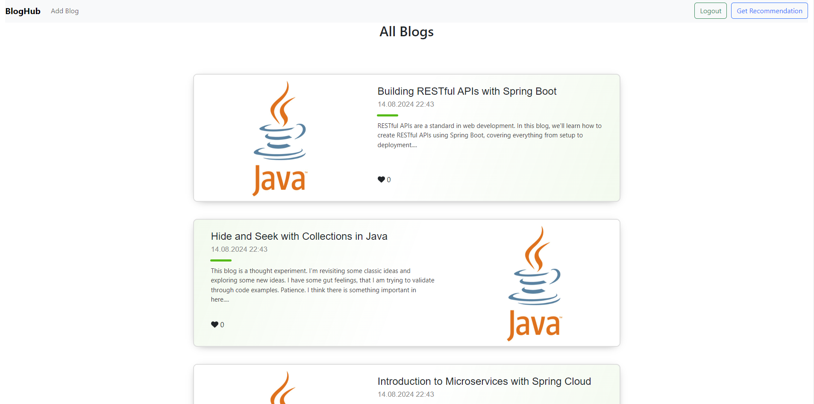

# spring-ai-recommendation


## Project
### A blog recommendation system entegrated to our BlogHub Application. It recommends new topics to the reader based on the previous blogs they have read.
- Spring-Boot
- Spring-AI
- OpenAI
- VektörDB


<!-- CONTACT -->
## Contact And Contributors

### Melih Beşel

<a href="https://github.com/melihbesel" target="_blank">

</a>
<a href = "mailto:mbesel2005@gmail.com?subject = Feedback&body = Message">

</a>
<a href="https://linkedin.com/in/melihbesel" target="_blank">

</a>


### Bedirhan Balcı

<a href="https://github.com/bedirhanbalci" target="_blank">

</a>
<a href = "mailto:bedirhanbalci@outlook.com?subject = Feedback&body = Message">

</a>
<a href="https://www.linkedin.com/in/bedirhanbalci" target="_blank">

</a>


### Hasan Toygun Şener

<a href="https://github.com/Sayvark" target="_blank">

</a>
<a href = "mailto:hasantoygunsener@gmail.com?subject = Feedback&body = Message">

</a>
<a href="https://www.linkedin.com/in/hasantoygunsener" target="_blank">

</a>


### Adem Özalp

<a href="https://github.com/admozlp" target="_blank">

</a>
<a href = "mailto:ademozalp57@gmail.com?subject = Feedback&body = Message">

</a>
<a href="https://www.linkedin.com/in/ademozalp/" target="_blank">

</a>

###

# Java Technologies
## Backend
### Spring Boot
### Spring AI
### OpenAI

# Javascript Technologies
## Frontend
### React
### Redux
### Axios

###

## Screeshots



##

## Project Download and Opening Steps

### Back-End

1. Clone the project to your computer: ```git clone https://github.com/melihbesel/spring-ai-recommendation.git```
2. Compile the project with Maven: ```mvn clean install```
3. Run the code to start the project: ```mvn spring-boot:run```

### Front-End

1. Enter the project directory (blogHub-front) to your project: ```cd blogHub-front```
2. Run the command to install project dependencies: ```npm install```
3. Run the code to start the project: ```npm start```


##

## API Documentation


# Save user
POST http://localhost:8080/api/v1/users
content-type: application/json

{
"name": "Adem",
"email": "ademozalp57@gmail.com",
"password": "123456"
}

###
# Change user status
PUT localhost:8080/api/v1/users/ademozalp57@gmail.com?statusType=APPROVED

###
# Create blog
POST localhost:8080/api/v1/blogs/users/ademozalp57@gmail.com
content-type: application/json

{
"title": "API Gateway (Ağ Geçidi) Nedir?",
"text": "Bir çok projede kullandığımız api, REST api vb. çağırımlarının her birinin yaptığı işlevi göz önüne alırsak ne kadar önemli olduğu kuşkusuz bir gerçek. Ancak bir o kadar önemli konu daha var. Güvenlik ve orkestrasyon. Kullandığımız bu apileri tek bir yerden yönetmek, yönlendirmek eve giriş kapısının bir yerden olduğu gibi önemlidir. Evin içerisine kimin girdiği ne yaptığını ilk aşamada kontrol ederiz. Bu sebeple api ağ geçidi bu konuda bizlere yardımcı oluyor. Ne olduğunu açıklamaya başlayalım."
}


###
POST localhost:8080/api/v1/blogs/users/ademozalp57@gmail.com
content-type: application/json

{
"title": "Load Balancer nedir ve ne işe yarar?",
"text": "Bu flood’da iş yükünü dağıtarak uygulamaların ölçeklenmesini sağlayan Load Balancer (Yük Dengeleyici)’lardan bahsedeceğim.Modern mimarilerinde artan trafiği karşılamak için mevcut kaynakları (CPU, memory) artırmak yerine yeni sunucu eklenmesi tercih edilmektedir. Mevcut kaynakları artırmak scale-up, yeni sunucular eklemekse scale-out olarak bilinir."
}


###
POST localhost:8080/api/v1/blogs/users/ademozalp57@gmail.com
content-type: application/json

{
"title": "How to implement Zipkin in Spring Boot 3",
"text": "To implement Zipkin in a Spring Boot application and run it using Docker Compose, follow these steps:"
}

###
POST localhost:8080/api/v1/blogs/users/ademozalp57@gmail.com
content-type: application/json

{
"title": "Spring AI Integration with OpenAI",
"text": "Spring AI applies the portability and modular design principles of the Spring ecosystem to the AI domain while developing AI applications. It helps in developing AI applications using Java objects."
}


###
POST localhost:8080/api/v1/blogs/users/ademozalp57@gmail.com
content-type: application/json

{
"title": "Method Idempotence Nedir?",
"text": "Bir metodun bir defa çağrıldığında alınan sonuç ile birden fazla kez çağrıldığında alınan sonuç aynı ise bu bir idempotent metottur."
}


###
POST localhost:8080/api/v1/blogs/users/ademozalp57@gmail.com
content-type: application/json

{
"title": "SonarQube Nedir ve Spring Boot Projemize Nasıl Entegre Ederiz?",
"text": "Merhaba, bu yazıda projelerimizde kullanmamızda büyük fayda olan bir araçtan bahsedeceğim. Daha sonra, bir çok farklı teknoloji ile entegre olabilen bu aracı Spring Boot projemize entegre edeceğiz ve bazı detayları inceleyeceğiz. Aşağıdaki maddeler üzerinden devam edelim:"
}


###
POST localhost:8080/api/v1/blogs/users/ademozalp57@gmail.com
content-type: application/json

{
"title": "File uploading with Spring Boot & Firebase Cloud Storage.",
"text": "Today I am going to show how you can upload images using Spring Boot and store them in the Firebase Cloud Storage."
}


###
POST localhost:8080/api/v1/blogs/users/ademozalp57@gmail.com
content-type: application/json

{
"title": "Microservice Mimarilerinde Service Discovery",
"text": "Merhaba.Bu yazıda microservice mimarilerinin temel konularından biri olduğunu düşündüğüm Service Discovery konusundan bahsetmek istiyorum."
}


###

#Get all blogs
GET http://localhost:8080/api/v1/blogs


###
# Get recommended blogs
GET http://localhost:8080/api/v1/blogs/recommendations
content-type: application/json

[
"Microservice Mimarilerinde Service Discovery",
"SonarQube Nedir ve Spring Boot Projemize Nasıl Entegre Ederiz?"
]


###


GET http://localhost:8080/api/v1/blogs/read/{title}

###

